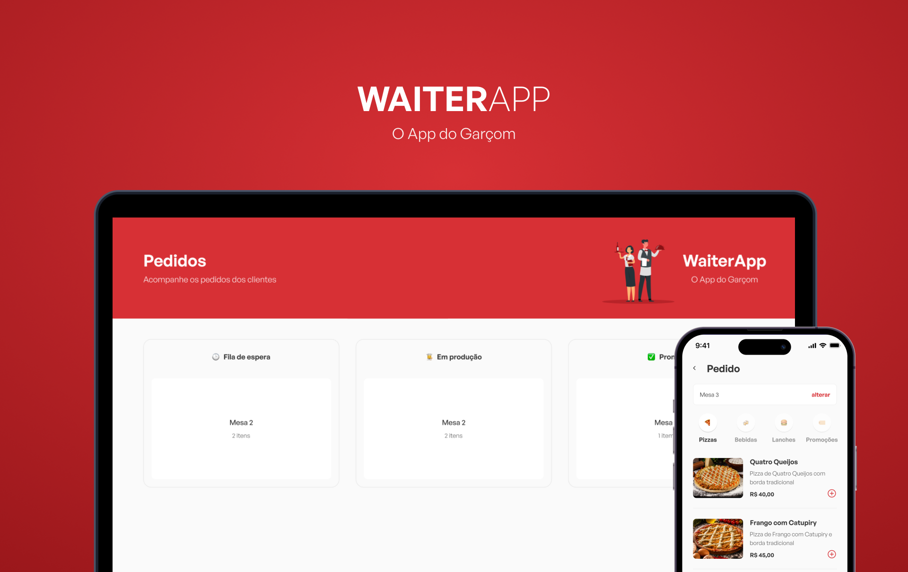

<h1 align="center">
  
</h1>

<h1 align="center">
  
</h1>

# Sobre o projeto

<p>
  Waiter App é uma aplicação para uso interno em lanchonetes, restaurantes, enfim, em qualquer estabelecimento que tenha atendimento em mesas por um garçom. Aqui é a versão mobile do app, onde é possível adicionar novos pedidos, filtrar por categorias e enviar em tempo real para o dashboard web.
</p>

# Tecnologias

- [React Native](https://pt-br.reactjs.org/)
- [Styled-components](https://styled-components.com/)
- [TypeScript](https://www.typescriptlang.org/)
- [Eslint](https://eslint.org/)

## Como baixar o projeto

```bash
# Clonar o repositório
$ git clone https://github.com/wellingtonrodriguesbr/waiter-app-mobile.git

# Entrar no diretório
$ cd waiter-app-mobile


# Instalar as dependências
$ yarn

# Rodar o projeto
$ yarn start
```

<br/>
<hr/>

<p align="center">Desenvolvido por <a href="https://www.linkedin.com/in/wellingtonrodriguesbr/" target="_blank">Wellington Rodrigues</a> ✌🏽</p>
